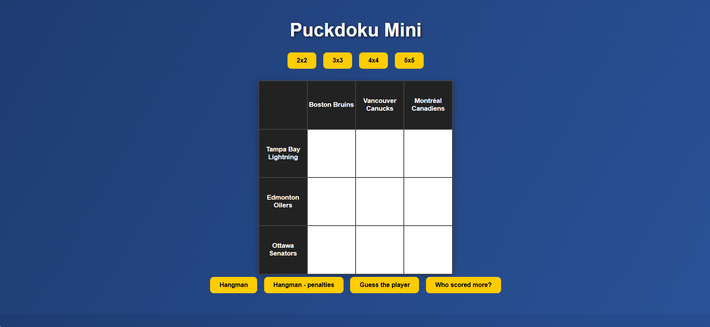

# NHL Game App

A full-stack interactive NHL-themed game platform featuring multiple mini-games built around player data, statistics, and hockey knowledge.

---

## Motivation

The goal of this project was to design an interactive sports-based application that combines real NHL data with game mechanics. The focus was on building reusable game logic, API-driven data retrieval, and a modular multi-game architecture.

---

## Features

- Multi-game platform with shared backend infrastructure
- Real-time NHL player data integration
- Dynamic puzzle generation (Puckdoku-style game)
- Statistical comparison engine (Duel mode)
- Data-driven guessing games (players, teams, penalties)
- Persistent data storage for custom game content (penalties DB)

---

## Game Modes

### Puckdoku Clone (`/`)
A grid-based puzzle game inspired by Puckdoku.  
Players must correctly match hockey players with teams they played for across different board sizes.

---

### Player Guessing Game (`/guess`)
Guess the NHL player based on the teams they have played for.

---

### Hangman (`/hangman`)
Classic hangman game using NHL player names as the word list.

---

### Penalty Hangman (`/hangman/penalties`)
Hangman mode where the words are NHL penalty names.

---

### Duel Mode (`/duel`)
Compare two NHL players and guess which one has better statistical performance based on given metrics.

---

## Tech Stack

- Python, frameworks FastAPI, Flask
- JavaScript
- HTML/CSS

## Architecture

- Backend: FastAPI / Flask handles game logic and data endpoints
- Frontend: JavaScript + HTML/CSS for UI and interactions
- Data: NHL player/team/statistics were collected from NHL API, penalty names for hangman are stored in a DB (which is local so far, so it is necessary to create the DB on the device to make sure the hangman with penalties runs as intended)

## Data 

### Data Sources

The application integrates publicly available NHL web endpoints to dynamically retrieve player information and statistics.

- Player search data is fetched via NHL public search endpoints
- Detailed player profiles are retrieved via NHL player API endpoints
- Additional game-specific datasets (penalties) are stored in a local database

All API usage is user-driven and cached where possible to minimize redundant requests.

### Data Flow

User → Frontend → Backend → NHL API / Database → Backend → Frontend

---

## How to Run

To install all dependencies, run:

```bash
pip install -r requirements.txt
```

Then run
```bash
uvicorn main:app --reload --port 8000
```

Then open index.html

---

## App Design


## Future Work

Implement a publicly accessible database of penalty names. Or implement another solution that eliminates the need to create a local DB on every device that runs the app, particularly the penalty hangman game. 

Improve the UI of the app.